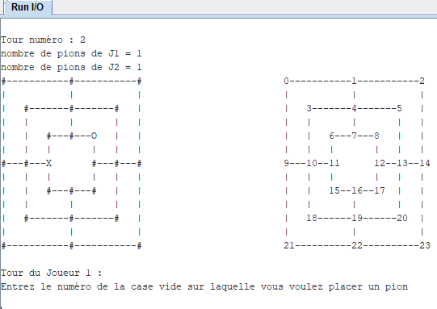

# Jeu-Du-Moulin-RiscV

Utiliser [Rars](https://github.com/TheThirdOne/rars) pour simuler du RiscV. Lancer Moulin.asm.
Screenshot :

### **VERMEREN Mathis et FLEISER Victor - EISE3 - Architecture des ordinateurs - Jeu du moulin en RiscV**

### **Rapport - Jeu du moulin**

---

### **Sujet**

Le jeu du moulin a été recréé en assembleur RiscV. Voici une explication des règles du jeu :

- Le jeu se déroule en 3 phases et se termine lorsqu'un joueur a moins de 3 pions ou n'a plus de mouvements possibles.
- **Phase 1** : Chaque joueur pose à tour de rôle un pion sur une case vide. Cette phase se termine une fois que les deux joueurs ont placé leurs 9 pions.
- **Phase 2** : Les joueurs déplacent un pion sur une case vide adjacente (reliée par un chemin). Cette phase se termine lorsqu'un joueur n'a plus que 3 pions.
- **Phase 3** : C'est la même que la phase 2, mais le(s) joueur(s) qui n'a(ont) plus que 3 pions peu(t/vent) "sauter" sur n'importe quelle case vide du terrain.
- Si un joueur forme un moulin (3 pions de même couleur alignés), il peut capturer un pion adverse qui ne fait pas partie d'un moulin. L'exception à cette règle est que si tous les pions de l'adversaire font partie d'un moulin, le joueur peut capturer n'importe quel pion de son choix.

---

### **Fonctionnement du jeu assembleur/C**

- Le terminal affiche deux plateaux : un pour le jeu et un autre pour les indices des cases.
- Les symboles sont les suivants : `-` et `|` pour les chemins, `#` pour une case vide, `O` pour le joueur 1 et `X` pour le joueur 2. Les nombres sur le second plateau sont les indices des cases.
- Le programme demande toujours à l'utilisateur d'entrer un nombre. Si l'entrée est incorrecte, le programme affiche un message d'erreur et demande de recommencer .
- Le programme n'est pas conçu pour gérer les chaînes de caractères.

---

### **Stratégie pour la réalisation du projet**

1.  Comprendre le jeu et créer une représentation visuelle du résultat attendu en ASCII.
2.  Créer le code complet en C, en définissant les structures de données pour le plateau (24 structures de cases) .
3.  Traduire le code en assembleur en créant un squelette de fichier et en traduisant les fonctions depuis le C. Pour la fonction d'initialisation, un programme C a été créé pour automatiser la traduction.

---

### **Ressources créées**

Plusieurs ressources ont été créées pour faciliter le projet, elles sont toutes disponibles sur un dépôt GitHub 32:

- **Dépôt GitHub** : `https://github.com/VictorFleiser/Moulin`.
- **Code C du jeu du moulin** (`moulin1.c`) : Le jeu a d'abord été créé en C pour simplifier la logique avant de la traduire en assembleur.
- **Tableur** (`ressources/moulin_struct_guide.ods`) : Un tableur a été utilisé pour montrer comment le plateau est stocké en mémoire. Une image de ce tableur est également disponible dans le rapport.
- **Code C d'automatisation** (`automatisation/automatisation.c`) : Un programme C a été créé pour automatiser la traduction des 65 lignes d'initialisation des voisins. Le programme prend les lignes C et affiche les lignes assembleur correspondantes.

---

### **Variables globales**

Plusieurs étiquettes ont été utilisées pour stocker des variables globales :

- `var_J1_nbr_de_pions` et `var_J2_nbr_de_pions` : Nombre de pions sur le terrain.
- `var_phase` : Phase du jeu (0 = fin, 1 = pose, 2 = mouvement/saut).
- `var_tour_j` : Tour de quel joueur (1 = Joueur 1, 2 = Joueur 2).
- `var_tour` : Numéro du tour.
- `var_tab_plateau` : Tableau des cases (24 cases \* 24 octets = 576 octets).

---

### **Structure utilisée**

Une seule structure a été utilisée, `t_case`, qui prend 24 octets. Elle contient les champs suivants :

- `.valeur` (integer, 4 octets) : Numéro du joueur (0 = vide, 1 = Joueur 1, 2 = Joueur 2).
- `.symbole` (caractère ASCII, 1 octet) : Symbole à afficher pour la case (`#` = vide, `X` = Joueur 1, `O` = Joueur 2).
- `.vn`, `.ve`, `.vs`, `.vo` (integer, 4 octets chacun) : Indice des cases voisines (Nord, Est, Sud, Ouest). La valeur est -1 si le voisin n'existe pas.

---

### **Fonctions utilisées**

Toutes les fonctions sont détaillées dans le fichier `moulin1.c`. Voici une liste non exhaustive :

- `affiche_plateau` : Affiche les deux plateaux. C'est une fonction complexe car elle alterne entre l'affichage de chaînes de caractères et de variables.
- `initialisation` : Initialise le tableau de `t_case` pour un plateau vide, y compris le réseau de voisins qui a été automatisé.
- `test_moulin` : Teste si la case correspondant à l’indice en paramètre fait
  partie d’un moulin. Cette fonction stocke un tableau de statuts (4 registres) (le statut
  correspond à un 1 si le voisin dans cette direction appartient aussi au joueur), ces
  statuts seront remplis puis testés à la fin pour savoir si la case est au centre d’un
  moulin.
  Cette fonction regarde si un voisin nord existe, si oui elle regarde si ce voisin nord
  appartient au même joueur, si oui elle change le statut correspondant et regarde si un
  voisin double nord existe, si oui elle regarde si il est appartient également au joueur,
  si oui on sait directement que la case fait partie d’un moulin.
  On fait de même pour les autres directions, puis on teste les registres de statuts pour
  savoir si la case est au centre d’un moulin.
  La fonction retourne 1 si la case fait partie d’un moulin, 0 sinon.
- `capture` : Demande au joueur quel pion capturer, puis le capture. La fonction gère la logique de l'exception de capture et met à jour le plateau ainsi que le nombre de pions du joueur affecté.

  Schéma des tests effectués :
  

- `place_pion` : Demande à l'utilisateur l'indice de la case pour placer un pion. Met à jour le plateau et le nombre de pions, puis renvoie l'indice joué.
- `deplace_pion` : Demande le pion à déplacer et sa destination. Met à jour le plateau et renvoie l'indice de destination.
- `saut_pion` : Similaire à `deplace_pion` mais ne teste pas si les cases sont voisines.
- `fin_de_partie` : Affiche le vainqueur et quitte le programme.
- `main` : Initialise le jeu et entre dans une boucle `while` qui dure tout le jeu. En fonction de la phase, elle appelle les fonctions appropriées (`place_pions`, `test moulin`, `capture`, `deplace_pion`, `saut_pion`).

---

### **Notations des étiquettes**

Les étiquettes suivent le format suivant :

`([précisions])_([if/while/for/else])_[fct/var/str]_[nom_fct/var/str]_[num_élément_dans_fct/data]_([précision])`

- Les champs entre parenthèses sont optionnels.
- `fct` = fonction, `var` = variable, `str` = chaîne de caractères.
- Exemple : `suite_if_fct_capture_4`.
